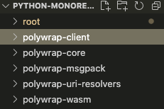

# Polywrap Python Client

## [Polywrap](https://polywrap.io) is a developer tool that enables easy integration of Web3 protocols into any application. It makes it possible for applications on any platform, written in any language, to read and write data to Web3 protocols.


# Working Features

This MVP Python client enables the execution of **[WebAssembly](https://en.wikipedia.org/wiki/WebAssembly) Polywrappers** *(or just "wrappers")* on a python environment, regardless of what language this wrapper was built in.

The client is built following the functionality of the [JavaScript Polywrap Client](https://github.com/polywrap/toolchain), which is currently more robust and battle tested, as it has additional capabilities than this MVP. In the future, the Polywrap DAO will continue improving this Python capabilities to reach feature parity with the JS stack.

Here you can see which features have been implemented on each language, and make the decision of which one to use for your project.

| Feature | [Python](https://github.com/polywrap/python-client) | [Javascript](https://github.com/polywrap/toolchain) | 
| -- | -- | -- |
| Invoke wrappers | yes | yes |
| Subinvoke wrappers | wip | yes |
| Interfaces | pending | yes |
| Env Configuration | | |
| Client Config Builder Package | wip | yes |
| Plugins | tbd | yes |
| Wrap Manifest | WIP | yes |
| Uri Resolution | legacy | refactored |
> TODO: Update table above according to test harness and maybe mention other wip clients (go, rust)


# Getting Started:

Have questions or want to get involved? Join our community [Discord](https://discord.polywrap.io) or [open an issue](https://github.com/polywrap/toolchain/issues) on Github.

For detailed information about Polywrap and the WRAP standard, visit our [developer documentation](https://docs.polywrap.io/).

## Pre-requisites

### Clone the repo. 
>```
>git clone https://github.com/polywrap/python-client
>```

> ### `python ˆ3.10`
> - Make sure you're running the correct version of python by running: 
> ```
> python3 --version
> ```
> - If you are using a Linux system or WSL, which comes with Python3.8, then you will need to upgrade from Python3.8 to Python3.10 and also fix the `pip` and `distutil` as upgrading to Python3.10 will break them. You may follow [this guide](https://cloudbytes.dev/snippets/upgrade-python-to-latest-version-on-ubuntu-linux) to upgrade.

> ### `poetry ^1.1.14`
> - To install poetry follow [this guide](https://python-poetry.org/docs/#installation). If you are on MacOS then you can install poetry simply with the following homebrew command 
> ```
> brew install poetry
> ```
> - To make sure you're it's installed properly, run `poetry`. Learn more [here](https://python-poetry.org/docs/)


#  Building and Testing

## Poetry 

- We will be using [Poetry](https://python-poetry.org) for building and testing our packages. 
 Each of the package folders consists the `pyproject.toml` file and the `poetry.lock` file. In `pyproject.toml` file, one can find out all the project dependencies and configs related to the package. These files will be utilized by Poetry to install correct dependencies, build, lint and test the package.

- For example, we can **install** deps, **build** and **test** the `polywrap-msgpack` package using Poetry. 

- Install dependencies using Poetry. 
```
poetry install
```
> Make sure your cwd is the appropriate module, for example `polywrap-msgpack`, `polywrap-wasm` or `polywrap-client`.

## Pytest

In order to assure the integrity of the modules Polywrap Python Client uses [pytest 7.1.3](https://docs.pytest.org/en/7.1.x/contents.html) as a testing framework.

- As we can see in the `pyproject.toml` files, we installed the [PyTest](https://docs.pytest.org) package. We will be using it as our testing framework. 
- Now we are ready to **build** and **test** the core package using Poetry and PyTest.
- To build the package run the following command
```
poetry build
```
- You need to activate the venv with poetry using the `shell` command before running any other command
  
```
poetry shell
```

Finally, to test your module to execute the test suite:
```
poetry run pytest
```


This last command will run a series of scripts that verify that the specific module of the client is performing as expected in your local machine. The output on your console should look something like this:

```c
$ poetry run pytest
>>
================================= test session starts =================================
platform darwin -- Python 3.10.0, pytest-7.1.3, pluggy-1.0.0
rootdir: /Users/polywrap/pycode/polywrap/toolchain/packages/py, configfile: pytest.ini
collected 26 items                                                                    

tests/test_msgpack.py ..........................                                [100%]
```

> ### Debugging with Pytest:
> 
> You should expect to see the tests passing with a 100% accuracy. To better understand and read these outputs, check [this quick guide](https://docs.pytest.org/en/7.1.x/how-to/output.html). If anything fails (marked with an 'F'), or if there are any Warnings raised, you can debug them by running a verbose version of the test suite:
> - `poetry run pytests -v` or `poetry run pytests -vv` for even more detail
> - Reach out to the devs on the [Discord](https://discord.polywrap.io) explaining your situation, and what configuration you're using on your machine.


## TOX 
 We are using [`tox`](https://tox.wiki/en) to run lint and tests even more easily. Below are some basic commands to get you running. 

### List all the testenv defined in the tox config
```
tox -a
```
### Run tests
```
tox
```

### Linting
```
tox -e lint
```
### Check types
```
tox -e typecheck
```

### Find security vulnerabilities, if any
```
tox -e secure
```

### Dev environment
Use this command to only apply lint fixes and style formatting.
```
tox -e dev
```

- After running these commands we should see all the tests passing and commands executing successfully, which means that we are ready to update and test the package.
- To create your own tox scripts, modify the `tox.ini` file in the respective module.

## VSCode users: Improved venv experience
If you use VSCode, we have prepared a pre-configured workspace, so to open the  workspace file `python-monorepo.code-workspace`, go to:

```
File -> Open Workspace from File...
```


Each folder is now a project to VSCode. This action does not change the underlying code, but facilitates the development process. So our file directory should look like this now:



### Picking up the virtual environments automatically
We will need to create a `.vscode/settings.json` file in each module's folder, pointing to the in-project virtual environment created by the poetry.

- You can easily find the path to the virtual env by running following command in the package for which you want to find it for:
```
poetry shell
```

- Once you get the path virtual env, you need to create the following `settings.json` file under the `.vscode/` folder of the given package. For example, in case of `polywrap-client` package, it would be under
`./polywrap-client/.vscode/settings.json`


Here's the structure `settings.json` file we are using for configuring the vscode. Make sure you update your virtual env path you got from poetry as the `python.defaultInterpreterPath` argument:
```json
{
  "python.formatting.provider": "black",
  "python.languageServer": "Pylance",
  "python.analysis.typeCheckingMode": "strict",
  "python.defaultInterpreterPath": "/Users/polywrap/Library/Caches/pypoetry/virtualenvs/polywrap-client-abcdef-py3.10"
}
```

Keep in mind that these venv paths will vary for each module you run `poetry shell` on. Once you configure these `setting.json` files correctly on each module you should be good to go!


# What WASM wrappers can you execute today?

Check these resources to browse a variety available wrappers, for DeFi, decentralised storage, and other development utilites:

- [Wrappers.io](https://wrappers.io/)
- [Polywrap Integrations Repository](https://github.com/polywrap/integrations)

# Example call

Calling a function of a wrapper from the python client is as simple as creating a file in the `TODO (?polywrap-client)` directory, importing the Polywrap Python Client, calling the Uri where the WASM wrapper is hosted, and specifying any required arguments.

```python
# get_eth_txns.py
from polywrap_client import PolywrapClient
from polywrap_core import Uri, InvokerOptions

async def get_eth_transactions(accountAddress):
    client = PolywrapClient()
    #uri = Uri("wrap://ens/defiwrapper.polywrap.eth")
    uri = Uri(f'fs/{Path(__file__).parent.joinpath("cases", "wrap.wasm").absolute()}')
    args = {
        "accountAddress": "'0x123EtherumAddress12312'"
    }
    options = InvokerOptions(uri=uri, method="simpleMethod", args=args, encode_result=False)
    result = await client.invoke(options)
    return result.result

if __name__ == "__main__":
    return get_eth_transactions(portfolio_address)
```


## Creating your own tests for the client

By creating tests you can quickly experiment with the Polywrap Client and its growing set of wrappers. Since Pytest is already set up on the repo, go to the `polywrap-client\tests\` directory, and take a look at how some of the functions are built. You can use similar patterns to mod your own apps and prototypes.

Here's a good guide to learn about [building tests with Pytest](https://realpython.com/pytest-python-testing/)

# Contributing

The Polywrap project is completely open-source and we welcome contributors of all levels. Learn more about how you can contribute [here](https://github.com/polywrap/toolchain#contributing).


# Contact Us:

[Join our discord](https://discord.polywrap.io) and ask your questions right away!


# Resources

- [Polywrap Documentation](https://docs.polywrap.io)
- [Polywrap Integrations Repository](https://github.com/polywrap/integrations)
- [Running operations concurrently with python's asyncio](https://realpython.com/async-io-python/#the-10000-foot-view-of-async-io)
- [Intro Video](TODO)
